# 4Kp60 Multi-Video Connectivity System Example Design for Agilex™ 5 Devices

This design is compatible with
[Altera® Quartus® Prime Pro Edition software version 26.1.1](https://www.altera.com/downloads/fpga-development-tools/quartus-prime-pro-edition-design-software-version-26-1-1-linux).

> **Important:** This document contains hyperlinks to related documentation. Figures and screenshots are examples. The hardware and software that you observe may differ slightly from the figures in this document.

---

## Contents

* [Overview](#overview)
* [Features and Specifications](#features-and-specifications)
* [Prerequisites](#prerequisites)
* [Getting Started](#getting-started)
* [Testing the Example Design on the Development Kit](#testing-the-example-design-on-the-development-kit)
* [Compiling the Example Design from Scratch](#compiling-the-example-design-from-scratch)
* [Functional Description](#functional-description)
* [Additional Information](#additional-information)
* [Related Documents](#related-documents)
* [Notices and Disclaimers](#notices-and-disclaimers)

---

## Overview

Modern video systems require connectivity across multiple protocol interfaces. Interoperability between legacy and modern equipment, and the end-of-life (EOL) status of some ASSP and ASIC video-bridge devices, increases that requirement.

The 4Kp60 Multi-Video Connectivity System Example Design for Agilex™ 5 Devices shows how a single FPGA device can unify HDMI, DisplayPort (DP), and serial digital interface (SDI) video using a common streaming protocol. The design converts between video protocols and processes video between these interfaces in real time.

<p align="center">
  
  <br><em>Multi-Video Connectivity Example Design Hardware</em>
</p>

The design receives SDI video through an FPGA mezzanine card (FMC) daughter card, and receives HDMI and DP video through the onboard connectors on the modular development kit.

All three video interfaces support standards up to UHD and can deliver video resolutions up to 4Kp60 to the FPGA fabric. Each interface converts pixel data to AXI4-Stream, which provides connectivity to other IP cores in the [Altera Video and Vision Processing (VVP) Suite](https://www.altera.com/products/ip/po-3150/video-and-vision-processing-suite).

The design comprises the following hardware and software components:

* **Hardware**—Three video datapaths, one for each input and output video interface. Each datapath includes a frame buffer and a video scaler that decouple frame rates and active video resolutions between the input and output interfaces. Input and output video switches route input video to the output interfaces that you select in the software application. The design also includes an input test pattern generator (TPG), additional VVP Suite IP cores for video preprocessing, and an embedded processor subsystem.

* **Software**—A bare-metal application that runs on a Nios® V soft processor. The application provides runtime control and debug menus through a JTAG UART interface.

The following figure shows the interaction between the Nios® V software and the hardware in the FPGA fabric.

<p align="center">
  
  <br><em>Multi-Video Connectivity Example Design—Top-Level System Block Diagram</em>
</p>


For block diagrams and a description of each IP core in the video pipeline, refer to [Functional Description](./mvc-funct-descr.md).

---

## Features and Specifications

The example design provides the following features:

* **Video interfaces (input and output)**
  * High-Definition Multimedia Interface (HDMI)
  * DisplayPort (DP)
  * Serial digital interface (SDI)

* **Input test pattern generator (TPG)**

* **Progressive video resolutions on the HDMI and DP input interfaces**
  * 720×480p at 60 Hz to 3840×2160p at 60 Hz

* **Progressive video resolutions on the SDI input interface**
  * 720p at 60 Hz
  * 1080p at 30 Hz and 60 Hz
  * 2K (2048×1080) at 30 Hz and 60 Hz
  * 2160p at 30 Hz and 60 Hz
  * 4K (4096×2160) at 30 Hz and 60 Hz

* **Progressive video resolutions on the output interfaces**
  * 720p at 60 Hz
  * 1080p at 60 Hz
  * 2160p at 30 Hz and 60 Hz

* **Color formats**

  | Interface | Supported color formats |
  |-----------|-------------------------|
  | HDMI RX | RGB, YCbCr 4:4:4, YCbCr 4:2:2 |
  | DP RX | RGB, YCbCr 4:4:4, YCbCr 4:2:2 |
  | SDI RX | RGB, YCbCr 4:4:4, YCbCr 4:2:2 |
  | HDMI TX | RGB |
  | DP TX | RGB |
  | SDI TX | YCbCr 4:2:2 |

* **Bit depth**
  * 8 bits and 10 bits per color channel

* **Multi-channel video processing subsystem**
  * 10-bit RGB processing at 2 pixels in parallel
  * 300 MHz processing clock
  * VVP Suite IP cores:
    * [Deinterlacer](https://docs.altera.com/r/docs/683329/25.1/video-and-vision-processing-suite-ip-user-guide/deinterlacer-ip)
    * [Chroma Resampler](https://docs.altera.com/r/docs/683329/25.1/video-and-vision-processing-suite-ip-user-guide/chroma-resampler-ip)
    * [Color Space Converter](https://docs.altera.com/r/docs/683329/25.1/video-and-vision-processing-suite-ip-user-guide/color-space-converter-ip)
    * [Test Pattern Generator](https://docs.altera.com/r/docs/683329/25.1/video-and-vision-processing-suite-ip-user-guide/test-pattern-generator-ip)
    * [Video Switch](https://docs.altera.com/r/docs/683329/25.1/video-and-vision-processing-suite-ip-user-guide/switch-ip)
    * [Scaler](https://docs.altera.com/r/docs/683329/25.1/video-and-vision-processing-suite-ip-user-guide/scaler-ip)
    * [Video Frame Buffer](https://docs.altera.com/r/docs/683329/25.1/video-and-vision-processing-suite-ip-user-guide/video-frame-buffer-ip)

* **Video routing modes**
  * One-to-one—Each output receives video from the input of the same interface type.
  * One-to-any—One input drives all three output interfaces.
  * Any-to-any—Each output receives video from an independently selected input.

---

## Prerequisites

### Hardware Requirements

The following hardware is required:

* [Agilex™ 5 FPGA and SoC E-Series 065B Modular Development Kit](https://www.altera.com/products/devkit/po-3274/agilex-5-fpga-and-soc-e-series-065b-modular-development-kit)
* [Nextera 12G-SDI FMC Daughter Card](https://www.nexteravideo.com/12g-sdi-fmc/)
* Power supply
* USB cable (USB-A to Micro-USB) for JTAG and serial console
* 12G-SDI certified cables
* 12G-SDI generator
* 12G-SDI analyzer
* HDMI and DisplayPort cables rated for 4K60
* HDMI and DisplayPort generators rated for 4K60
* HDMI and DisplayPort analyzers or monitors rated for 4K60

The following figure shows the Agilex™ 5 FPGA and SoC E-Series 065B Modular Development Kit.

<p align="center">
  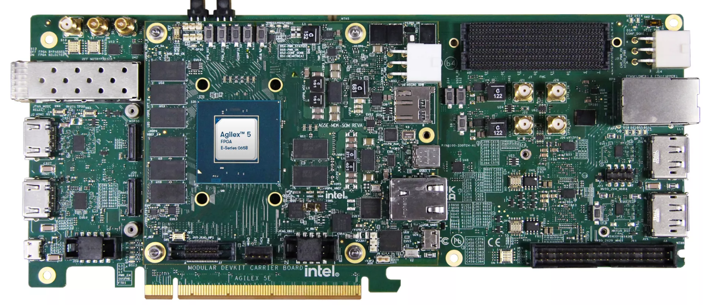
  <br><em>Agilex™ 5 FPGA and SoC E-Series 065B Modular Development Kit</em>
</p>

### Software Requirements

The following software is required:

* [Altera® Quartus® Prime Pro Edition software version 26.1.1](https://www.altera.com/downloads/fpga-development-tools/quartus-prime-pro-edition-design-software-version-26-1-1-linux)
* Agilex™ 5 device support
* [Visual Designer Studio](https://www.altera.com/products/development-tools/visual-designer-studio)
* [FPGA Nios® V Open-Source Tools version 26.1.1](https://www.altera.com/design/guidance/nios-v-developer)

### Repository and Release Assets

The following table lists the release assets for Quartus® Prime Pro Edition software version 26.1.1.

> **Note:** This system example design is provided for demonstration only. The design is not suitable for production or final deployment.

| Component | Location | Branch or Tag |
|-----------|----------|---------------|
| Assets release tag | [rel-26.1.1](https://github.com/altera-fpga/agilex5e-ed-mvc-video/releases/tag/rel-26.1.1) | `rel-26.1.1` |
| Precompiled SOF | [golden_4k_mvc_ed.sof](https://github.com/altera-fpga/agilex5e-ed-mvc-video/releases/download/rel-26.1.1/golden_4k_mvc_ed.sof) | `rel-26.1.1` |
| Quartus project | [agilex5e_mdk_4k_mvc_ed.zip](https://github.com/altera-fpga/agilex5e-ed-mvc-video/releases/download/rel-26.1.1/agilex5e_mdk_4k_mvc_ed.zip) | `rel-26.1.1` |
| Source code | [agilex5e-ed/a5e065b-mod-devkit](https://github.com/altera-fpga/agilex5e-ed-mvc-video/tree/rel/26.1.1/agilex5e-ed/a5e065b-mod-devkit) | `rel-26.1.1` |
| Public repository | [agilex5e-ed-mvc-video](https://github.com/altera-fpga/agilex5e-ed-mvc-video/tree/rel/26.1.1) | `rel-26.1.1` |

---

## Getting Started

This section describes how to download a precompiled SRAM Object File (.sof) and set up the Agilex™ 5 FPGA and SoC E-Series 065B Modular Development Kit to run the example design.

### Downloading the Precompiled FPGA SOF

Download the precompiled programming file listed in the following table.

| Source | Link | Description | Device Part Number |
|--------|------|-------------|--------------------|
| Precompiled SOF | [golden_4k_mvc_ed.sof](https://github.com/altera-fpga/agilex5e-ed-mvc-video/releases/download/rel-26.1.1/golden_4k_mvc_ed.sof) | SOF for the [Agilex™ 5 FPGA and SoC E-Series 065B Modular Development Kit](https://www.altera.com/products/devkit/po-3274/agilex-5-fpga-and-soc-e-series-065b-modular-development-kit) | A5ED065BB32AE4S |

### Setting Up the Development Kit

> **Warning:** Handle electrostatic discharge (ESD)-sensitive equipment only when you are properly grounded and working at an ESD-safe workstation.

To set up the development kit, follow these steps:

1. Ensure that the development kit power switch is off and that the power supply is disconnected.

2. Configure the development kit switches to the factory default positions. For switch settings, refer to the [Agilex 5 FPGA E-Series 065B Modular Development Kit User Guide](https://docs.altera.com/r/docs/820977/current/agilex-5-fpga-e-series-065b-modular-development-kit-user-guide/default-settings).

   The following figures show the switch locations on the system-on-module (SOM) and on the carrier board.

<p align="center">
  
  <br><em>Modular Development Kit—System-on-Module (SOM) Switch Locations</em>
</p>

<p align="center">
  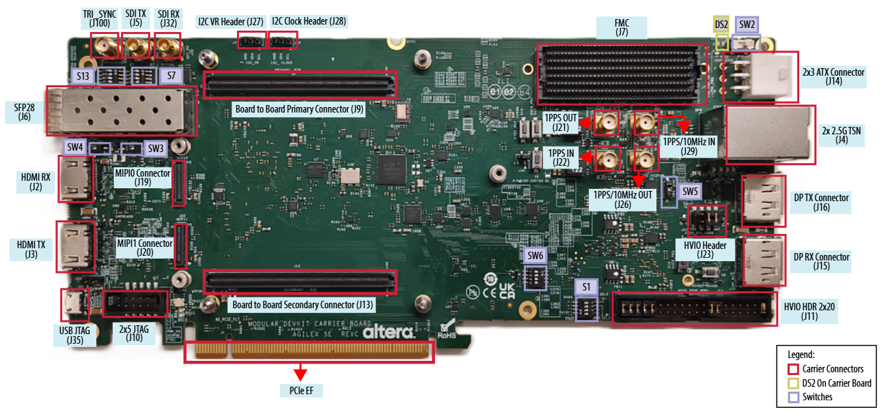
  <br><em>Modular Development Kit—Carrier Board Topside Switch Locations</em>
</p>

3. Connect a USB-JTAG cable between the host computer and USB connector J35 on the development kit.

4. Configure the Nextera 12G-SDI FMC daughter card for **297 MHz** and **SDI mode**, as shown in the following figure.

<p align="center">
  
  <br><em>Nextera 12G-SDI FMC Daughter Card</em>
</p>

5. Install the Nextera 12G-SDI FMC daughter card on FMC port J7 of the development kit.

6. Connect an SDI cable between the BNC RX connector on the FMC daughter card (J1, 12G In) and an external SDI video source.

7. Connect an SDI cable between the BNC TX connector on the FMC daughter card (J2, 12G Out) and an SDI video monitor.

8. Connect an HDMI cable between the HDMI RX connector on the development kit (J2, HDMI In) and an external HDMI video source.

9. Connect an HDMI cable between the HDMI TX connector on the development kit (J3, HDMI Out) and an HDMI video monitor.

10. Connect a DisplayPort cable between the DP RX connector on the development kit (J15, DP In) and an external DisplayPort video source.

11. Connect a DisplayPort cable between the DP TX connector on the development kit (J16, DP Out) and a DisplayPort video monitor.

12. Connect the power supply to connector J14 on the development kit.

> **Note:** Connectors J1 and J2 in steps 6 and 7 are on the FMC daughter card. All other connectors are on the development kit carrier board.

Your hardware setup must match the following figure.

<p align="center">
  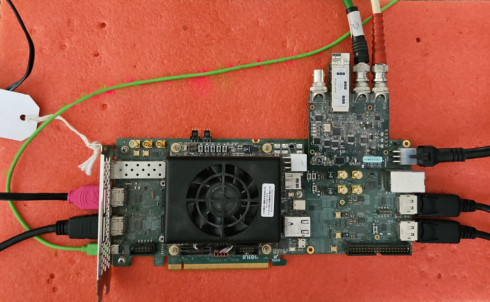
  <br><em>Complete Hardware Setup</em>
</p>

---

## Testing the Example Design on the Development Kit

This section describes how to program the FPGA and run the demonstration software.

### Programming the Development Kit

To program the development kit, follow these steps:

1. Complete the hardware setup described in [Setting Up the Development Kit](#setting-up-the-development-kit).

2. Power up the board.

3. Launch the Quartus® Programmer and configure **Hardware Setup** as shown in the following figure.

<p align="center">
  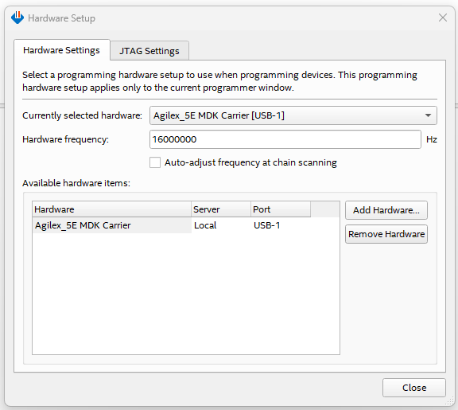
  <br><em>Programmer GUI—Hardware Settings</em>
</p>

4. Click **Auto Detect**, select device `A5ED065BB32AE4S`, and then click **Change File**.

<p align="center">
  
  <br><em>Programmer After Auto Detect</em>
</p>

5. Select the SRAM Object File, for example `golden_4k_mvc_ed.sof`.

6. Turn on the **Program/Configure** option, and then click **Start**.

7. Wait until programming completes.

<p align="center">
  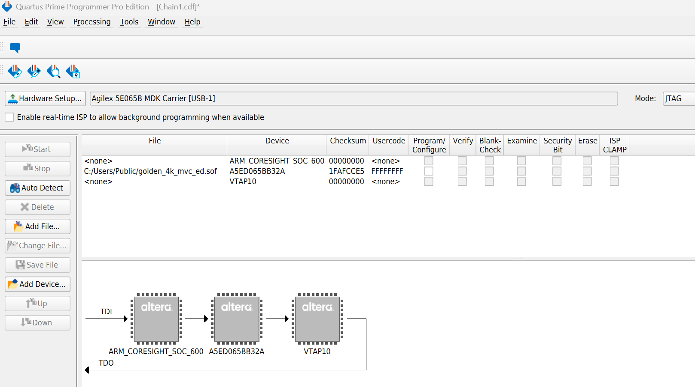
  <br><em>Programming the FPGA with an SRAM Object File</em>
</p>

### Running the Demonstrations

After programming completes, open a JTAG UART terminal.

On Linux, type the following command:

```bash
juart-terminal --instance 1 --device 0
```

On Windows, type the following command:

```bash
juart-terminal.exe --instance 1 --device 0
```

> **Note:** The instance and device indices depend on your JTAG chain. If the terminal does not connect, run `juart-terminal --help` to list the available instances and devices.

When the connection is successful, the terminal displays the demonstration banner.

<p align="center">
  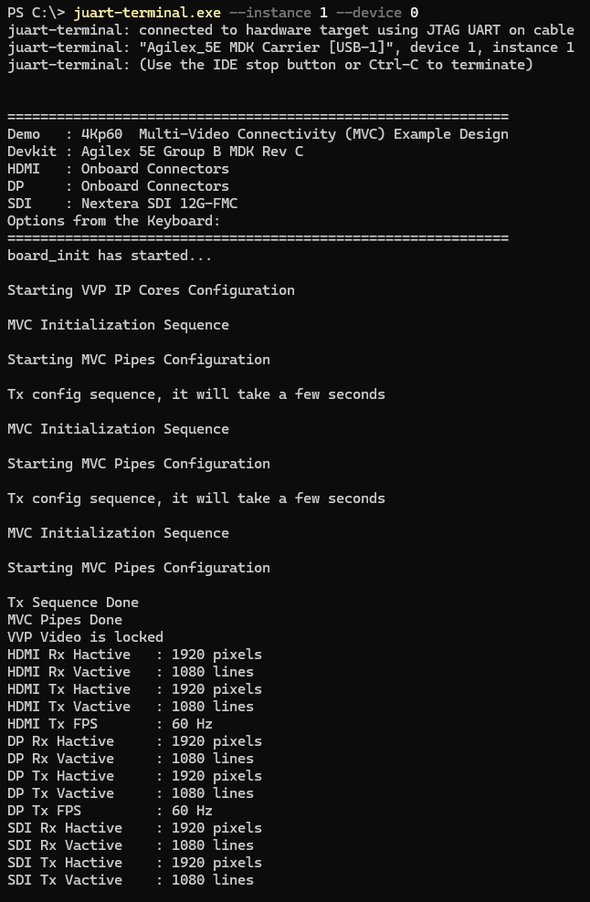
  <br><em>Demonstration Banner</em>
</p>

Press **h** to display the demonstration menu.

<p align="center">
  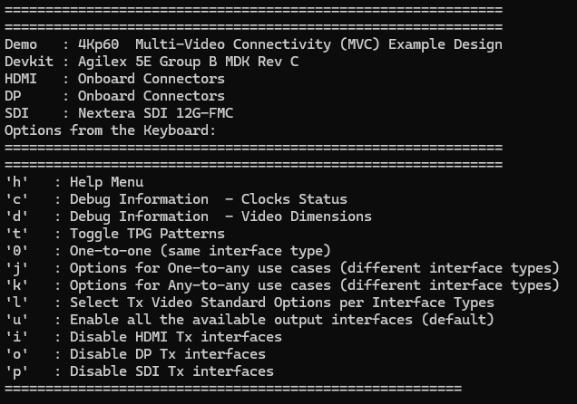
  <br><em>Demonstration Menu</em>
</p>

Each menu option is mapped to a keyboard character. The following table lists the demonstration menu commands.

| Key | Action |
|:---:|--------|
| `h` | Display the help menu |
| `c` | Display debug information for the system clock status |
| `d` | Display debug information for the video dimensions |
| `t` | Toggle the input TPG pattern |
| `0` | Select one-to-one routing, where each output receives video from the input of the same interface type |
| `j` | Display the one-to-any routing options, where one input drives all three outputs |
| `k` | Display the any-to-any routing options, where each output receives an independently selected input |
| `l` | Select the TX video standard for each interface type |
| `u` | Enable all available output interfaces (default) |
| `i` | Disable the HDMI TX interface |
| `o` | Disable the DP TX interface |
| `p` | Disable the SDI TX interface |

Press **c** to display the clock status, as shown in the following figure.

<p align="center">
  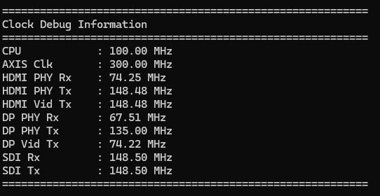
  <br><em>System Clock Status</em>
</p>

Press **d** to display the incoming video dimensions, as shown in the following figure.

<p align="center">
  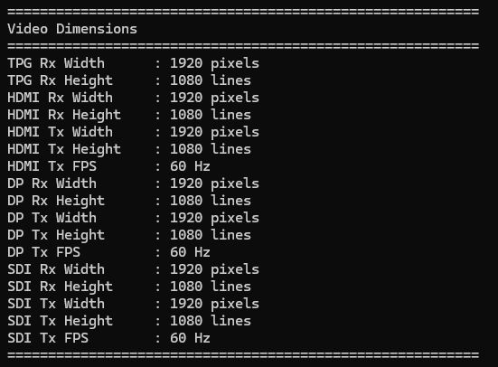
  <br><em>Incoming Frame Status</em>
</p>

Press **t** to cycle through the patterns that the input TPG generates, as shown in the following figure.

<p align="center">
  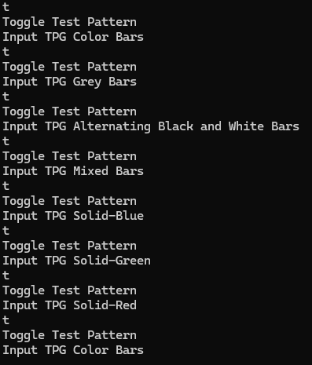
  <br><em>Supported TPG Patterns</em>
</p>

Press **0** to select the one-to-one video routing use case, as shown in the following figure.

<p align="center">
  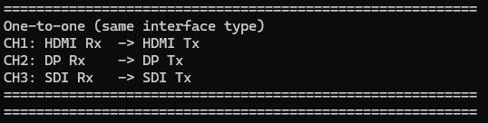
  <br><em>One-to-One Video Routing Use Case</em>
</p>

Press **j** to display the one-to-any video routing use cases, as shown in the following figure.

<p align="center">
  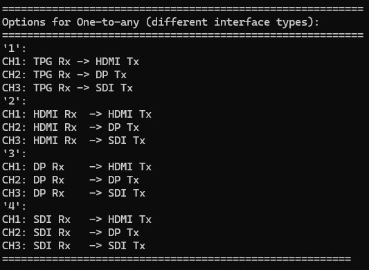
  <br><em>Supported One-to-Any Video Routing Use Cases</em>
</p>

Press **k** to display the any-to-any video routing use cases, as shown in the following figure.

<p align="center">
  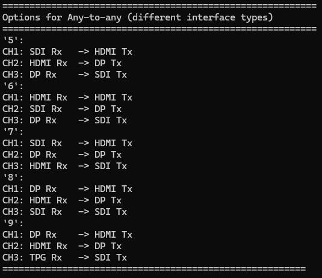
  <br><em>Supported Any-to-Any Video Routing Use Cases</em>
</p>

Press **l** to display the TX video standard options for each interface type, as shown in the following figure.

<p align="center">
  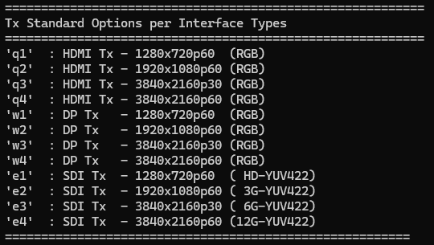
  <br><em>Supported TX Video Standard Options for Each Interface Type</em>
</p>

For a description of the routing use cases that the video switches implement, refer to [Video Switch IP](./mvc-funct-descr.md#video-switch-ip).

---

## Compiling the Example Design from Scratch

This section describes how to compile the example design in the Quartus® Prime Pro Edition software and generate an SRAM Object File (.sof).

To compile the example design, follow these steps:

1. Download the Quartus project from the assets release tag listed in [Repository and Release Assets](#repository-and-release-assets).

2. Extract the package.

3. Confirm that the FPGA design files are in `src/vds/`, `src/rtl/`, and `src/ip/`, and that the software files are in `src/sw/`.

   The example design directory structure is as follows:

```text
<Example Design>/
├── top.qpf                  # Quartus project file
├── top.qsf                  # Quartus settings file
├── da_drc.dawf              # Design Assistant waiver file
├── README.md                # Repository readme
├── docs/                    # User guide for this example design
├── output_files/            # Precompiled SOF, and destination for newly compiled SOF
├── script/                  # Scripts used to generate the example design
└── src/
    ├── ip/                  # .ip files
    ├── rtl/                 # RTL and SDC files
    ├── sw/                  # Bare-metal software application
    └── vds/                 # Tcl script that generates the Visual Designer Studio (VDS) project
```

4. Launch the Quartus® Prime Pro Edition software.

5. Open `<Example Design>/top.qpf`.

6. On the **Processing** menu, click **Start Compilation**.

7. Wait until compilation completes.

After a successful compilation, the Quartus® Prime Pro Edition software generates the `top.sof` programming file in the `<Example Design>/output_files/` directory.

### Recompiling the Nios® V Software Application

To rebuild the Nios® V software application and merge it into the .sof, type the following commands:

```bash
cd <Example Design>/script/
quartus_sh -t post_swapp_mvc_gen.tcl
```

The script compiles the Nios® V application, merges the generated hexadecimal (HEX) ROM file into the project, and generates an updated `top.sof` that contains the latest software.

---

## Functional Description

For a description of the system architecture, the video pipeline, and each IP core that the design instantiates, refer to [Functional Description](./mvc-funct-descr.md).

---

## Additional Information

* [Design Security Considerations](./design-security-considerations.md)
* [Acronyms and Terminology](./glossary.md)

---

## Related Documents

* [Agilex™ 5 FPGA and SoC E-Series 065B Modular Development Kit](https://www.altera.com/products/devkit/po-3274/agilex-5-fpga-and-soc-e-series-065b-modular-development-kit)
* [Agilex 5 FPGA E-Series 065B Modular Development Kit User Guide](https://docs.altera.com/r/docs/820977/current/agilex-5-fpga-e-series-065b-modular-development-kit-user-guide/default-settings)
* [Nextera 12G-SDI FMC Daughter Card](https://www.nexteravideo.com/12g-sdi-fmc/)
* [Phabrix QxL SDI Generator and Analyzer](https://leaderphabrix.com/products/qxl/)
* [Video and Vision Processing Suite Altera® FPGA IP User Guide](https://www.altera.com/products/ip/po-3150/video-and-vision-processing-suite)
* [Altera® FPGA Streaming Video Protocol Specification](https://docs.altera.com/r/docs/683397/current/altera-streaming-video-protocol-specification/about-the-altera-streaming-video-protocol)
* [AMBA 4 AXI4-Stream Protocol Specification](https://developer.arm.com/documentation/ihi0051/a/)
* [GTS HDMI IP User Guide](https://docs.altera.com/r/docs/823533/26.1/gts-hdmi-ip-user-guide/gts-hdmi-ip-quick-reference)
* [DisplayPort IP User Guide](https://docs.altera.com/r/docs/683273/25.3/displayport-ip-user-guide/displayport-ip-quick-reference)
* [GTS SDI II IP User Guide](https://docs.altera.com/r/docs/823539/25.3/gts-sdi-ii-ip-user-guide/gts-sdi-ii-ip-quick-reference)
* [Visual Designer Studio](https://www.altera.com/products/development-tools/visual-designer-studio)
* [Nios® V Processor](https://www.altera.com/products/ip/po-3098/nios-v-processors)

---

## Notices and Disclaimers

Altera<sup>&reg;</sup> Corporation technologies may require enabled hardware, software or service activation.
No product or component can be absolutely secure.
Performance varies by use, configuration and other factors.
Your costs and results may vary.
You may not use or facilitate the use of this document in connection with any infringement or other legal analysis concerning Altera or Intel products described herein. You agree to grant Altera Corporation a non-exclusive, royalty-free license to any patent claim thereafter drafted which includes subject matter disclosed herein.
No license (express or implied, by estoppel or otherwise) to any intellectual property rights is granted by this document, with the sole exception that you may publish an unmodified copy. You may create software implementations based on this document and in compliance with the foregoing that are intended to execute on the Altera or Intel product(s) referenced in this document. No rights are granted to create modifications or derivatives of this document.
The products described may contain design defects or errors known as errata which may cause the product to deviate from published specifications. Current characterized errata are available on request.
Altera disclaims all express and implied warranties, including without limitation, the implied warranties of merchantability, fitness for a particular purpose, and non-infringement, as well as any warranty arising from course of performance, course of dealing, or usage in trade.
You are responsible for safety of the overall system, including compliance with applicable safety-related requirements or standards.
<sup>&copy;</sup> Altera Corporation. Altera, the Altera logo, and other Altera marks are trademarks of Altera Corporation. Other names and brands may be claimed as the property of others.

OpenCL* and the OpenCL* logo are trademarks of Apple Inc. used by permission of the Khronos Group™.
